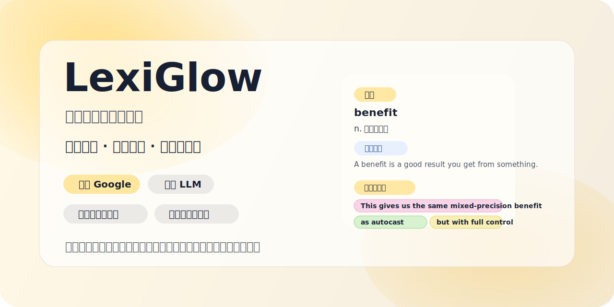

# LexiGlow



<p align="center">
  Learn English where you already read: docs, articles, newsletters, timelines, and product pages.
</p>

<p align="center">
  <a href="https://github.com/xiaoyao888888/lexiglow/stargazers">
    
  </a>
  <a href="https://github.com/xiaoyao888888/lexiglow/blob/main/LICENSE">
    
  </a>
  
  
</p>

LexiGlow is a Chrome extension for context-based English learning. It keeps your reading flow intact, marks only the words you still need, and lets you decide when to stay lightweight and when to ask for deeper help.

The current experience is built around three natural reading moves:

- Hover a highlighted word to get a fast Chinese translation
- Double-click a word to pull it back into review when you realize you have forgotten it
- Select any English text, from a single word to a full sentence, to get a default Google translation plus optional `LLM 翻译` and `长难句翻译`

It is intentionally low-intrusion:

- no DOM wrapping of page text
- no layout-breaking rewrites
- no mandatory full-page translation
- just soft highlighting, one tooltip system, and progressive vocabulary tracking

## Why LexiGlow Feels Different

Most tools force a tradeoff:

- instant lookup but no learning memory
- learning memory but awkward reading flow
- sentence analysis but in a separate app or tab

LexiGlow tries to combine all three in one loop:

1. Keep reading real content
2. Notice only the words you still care about
3. Get a quick answer first
4. Ask for deeper help only when you want it
5. Let your own interactions gradually reshape the vocabulary model

## Reading Workflows

### 1. Hover to learn in flow

- Unfamiliar words are softly highlighted in yellow
- Hovering a highlighted word shows a Chinese translation
- Google is the default translator
- If the default result feels too rough, click `LLM 翻译` for a context-aware refinement
- If the word is actually noise for you, click `永不翻译`
- If the word is now part of your working vocabulary, click `已掌握`

### 2. Double-click to bring a word back

Sometimes a word is technically "known" in your model, but you have forgotten it in the moment.

LexiGlow treats double-click as a review action:

- the word is put back into review mode
- the page updates immediately
- the tooltip defaults to Google translation
- you can still switch to LLM if you want a better explanation

### 3. Select text to understand meaning fast

When you select English text on a page, LexiGlow now uses one unified tooltip flow:

- select one word, a phrase, or a full sentence
- get a default Google translation immediately
- click `LLM 翻译` if you want a better context-aware result
- click `长难句翻译` if you want a structured sentence breakdown

This keeps the interaction simple:

- quick answer first
- expensive analysis second
- always inside the same tooltip

## Core Features

- Dynamic known-word threshold based on the Google 10,000 English frequency list
- Manual learned-word growth over time
- Review mode for forgotten words via double-click
- Ignore logic for brands, handles, names, and non-learning targets
- Default Google translation with optional OpenAI-compatible LLM refinement
- Unified selected-text translation flow for words, phrases, and full sentences
- Long-sentence analysis in the same tooltip, not a second popup
- Color-coded keyword highlighting for sentence structure:
  - subject
  - predicate
  - non-finite verbs
  - conjunctions
  - relative words
  - prepositions
- Toolbar popup for current learning stats
- Full settings page for threshold, overrides, ignored words, and translator configuration

## Long-Sentence Analysis

LexiGlow's long-sentence mode is designed for Chinese learners who want more than a raw translation.

The analysis flow follows a practical exam-style reading method:

1. Cut the sentence into layers with conjunctions, relative words, and punctuation
2. Find the main clause backbone by locating the core subject and predicate
3. Separate branches such as non-finite verbs, prepositional phrases, and subordinate clauses
4. Rebuild the sentence into natural Chinese

The result is shown in the same tooltip and includes:

- the original sentence with color highlights
- a full Chinese translation
- a short backbone summary
- step-by-step explanation

If the selected text is too short to justify full analysis, the tooltip stays in translation mode and gives a light hint instead of forcing noisy output.

## Vocabulary Model

LexiGlow combines frequency defaults with personal overrides:

1. Start from a ranked 10k English frequency list
2. Treat the top `N` words as already known
3. Highlight only words that are still worth learning
4. Let user actions override the default model
5. Keep the page state in sync as soon as words are learned or reintroduced

Learning state is stored as:

- `knownBaseRank` for the base high-frequency threshold
- `masteredOverrides` for extra learned words
- `unmasteredOverrides` for words pulled back into review
- `ignoredWords` for terms that should never trigger translation

## Storage and Sync

LexiGlow intentionally splits data by purpose.

Synced with your Chrome account through `chrome.storage.sync`:

- known-word threshold
- learned-word overrides
- review overrides
- ignored words

Stored only on the current device through `chrome.storage.local`:

- translator settings
- local API key
- translation cache

This means your learning progress can follow the same synced Chrome profile, while sensitive translator settings stay local to the machine.

## Translator Setup

LexiGlow supports:

- Google web translation as the default fast path
- OpenAI-compatible chat completion APIs for LLM refinement and long-sentence analysis

Configurable translator settings include:

- `base_url`
- `model`
- API key
- fallback-to-Google behavior
- LLM display mode:
  - word-only
  - word plus full-sentence translation

## Install for Development

```bash
npm install
npm run fetch:lexicon
npm run build
npm test
```

Then load the extension in Chrome:

1. Open `chrome://extensions`
2. Enable `Developer mode`
3. Click `Load unpacked`
4. Select either:
   - the project root after build, or
   - the `dist` folder

## What To Test First

After loading the extension, a good smoke test is:

1. Hover a highlighted word and confirm the tooltip shows Chinese
2. Click `LLM 翻译` and confirm the result upgrades in place
3. Double-click a known word and confirm it comes back into review
4. Select a phrase and confirm Google translation appears immediately
5. Select a full sentence and click `长难句翻译`
6. Click `已掌握` on a word and confirm matching highlights disappear on the page immediately

## Tech Stack

- TypeScript
- Vite
- esbuild
- Chrome Manifest V3
- Native CSS Highlights API where available
- Google web translation prototype
- OpenAI-compatible LLM provider support

## Current Limitations

- Chrome-focused for now
- Uses a lightweight Google web translate prototype instead of an official paid API
- Long-sentence analysis quality still depends on the configured LLM
- Sentence highlighting uses a mix of model output and local heuristics, so it is useful but not full syntactic parsing
- Tooltip positioning is tuned for reading flow, but dense pages and unusual selection shapes can still produce edge cases
- The extension is optimized for normal `http/https` pages, not every browser surface

## Roadmap

- Better proper-noun and named-entity filtering
- Better clause grouping and sentence-structure highlighting
- More polished tooltip states and feedback animations
- Optional personal export/import of learning progress
- Smarter translation providers and caching strategies
- Chrome Web Store packaging and release automation

## Validation

- `npm test`
- `npm run build`

## License

MIT
