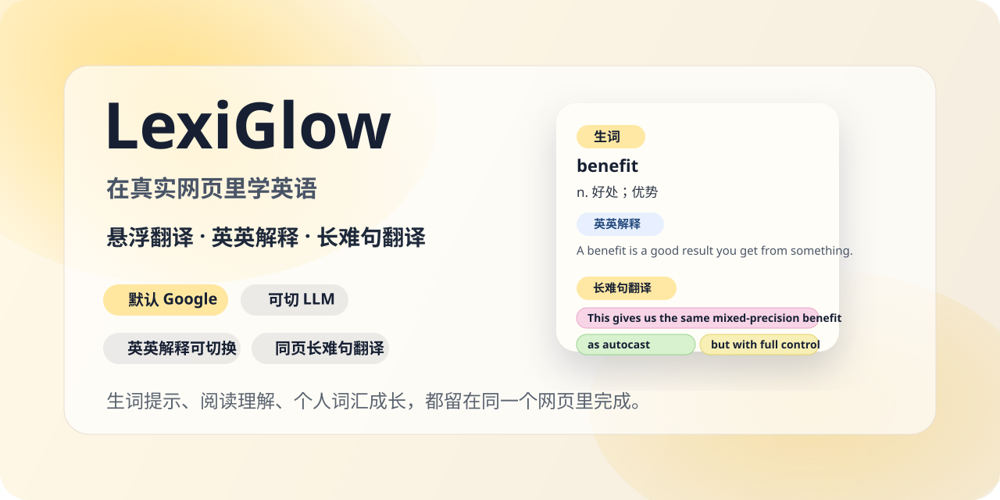

# LexiGlow | 在工作流里顺手学英语

[English README](./README.md)



<p align="center">
  默认用 Google 快速查词，只有在需要更高质量时才切到语境翻译；复习、英英解释和长难句分析都留在当前页面完成。
</p>

<p align="center">
  <a href="https://github.com/ArseneWg/lexiglow/stargazers">
    
  </a>
  <a href="https://github.com/ArseneWg/lexiglow/blob/main/LICENSE">
    
  </a>
  <a href="https://github.com/ArseneWg/lexiglow/blob/main/COMMERCIAL.md">
    
  </a>
  
  
</p>

## LexiGlow 是什么

LexiGlow 是一个 Chrome 英语阅读插件。它不是让你切出去背词，而是把查词、复习、发音、语境翻译、英英解释和长难句分析直接叠加到你平时的网页阅读里。

它更适合这类阅读场景：

- 悬停未掌握单词、复合词或高价值短语，先快速看默认翻译
- 默认结果不够准时，再切到语境翻译
- 遇到以前学过但又忘了的词，双击把它拉回复习
- 想用英文理解单词时，直接看一版符合自己词汇水平的解释
- 遇到复杂句子，直接在同一个 tooltip 里拆解理解

## 为什么这样设计

- 默认轻量，按需增强：先给 Google 结果，响应更快，也更省 token；只有在需要更高质量时再切到语境翻译
- 不打断阅读：悬停查词、选中文本翻译、发音、长难句分析都留在当前页面完成
- 解释会跟着你的水平变化：英英解释会参考你的已掌握词汇量，尽量用你看得懂的英语来解释新词
- 用户操作优先于自动判断：词频只是初始估计，明确的“已掌握 / 重新学习 / 忽略”会覆盖自动规则
- 已支持学习语言切换：翻译内容和插件界面都可以跟随学习语言切换

内部的 A1-C1 标签只是基于已掌握词汇量的难度估算，用于调整解释用词，不属于正式 CEFR 能力测评。

## Learning Engine v2

LexiGlow 现在把自动词汇判断当成“保守辅助”，而不是绝对真相：

- **置信度词形归并**：高置信规则词形和安全的不规则形式共享学习状态，例如 `work / worked / working`、`go / went`、`write / written`；`lives / saw / left / rose` 这类容易误合并的形式会保持独立，避免污染长期学习记录。
- **复合词与短语层**：`mixed-precision / high-impact` 会作为完整词汇单元处理；`account for / carry out / take into account` 等高价值表达也可以成为学习目标。
- **文章内重复优先级**：同一篇文章反复出现的生词会提高高亮优先级，减少“只出现一次的冷门词”对注意力的占用。
- **熟悉度与间隔曝光**：重新学习的词会从强高亮开始，随着 exposure 增加逐渐变弱；达到一定熟悉度后可在复习间隔内暂时休息，到期后再次变强。只有用户明确点击“已掌握”，才真正结束重新学习状态。
- **更保守的专有词过滤**：技术标识符、handle、明显拼音等仍会过滤，但不会再仅因为首字母大写或单词很长就把高级词误判为专有名词。
- **运行时 O(1) 学习状态查询**：已掌握、重学、忽略状态在高亮热路径中使用 Set 索引，避免长期使用后 override 数量增加造成线性扫描。

## 高亮、语境与长难句

- 高亮引擎改为 **增量 + viewport-aware**：初始只登记文本节点，进入或接近视口后才分析；DOM Mutation 只处理新增或变化节点，scroll 不再重新扫描整页。
- 高亮仍使用 CSS Highlight API，不向原网页文本注入一堆 `<span>`。
- 用户主动划词始终尊重翻译意图，不再因为自动 proper-name 规则直接返回原文。
- 划词原文和周边 context 分开处理：最多 1200 字符的选中原文会完整保留，不再被 220 字符上下文窗口静默截断；超过上限会明确显示可见的“选择过长”提示，并且不会发送翻译请求。
- 语境提取优先使用 `Intl.Segmenter`，并从上层 DOM 容器还原被 `<a> / <strong> / <span>` 拆开的完整句子。
- 长难句分析使用带 `tokenIndex` 的结构坐标，因此一句话中多个 `that` 等重复词不会只靠“第一个文本匹配”来高亮；复合词与页面 tokenizer 使用相同的 token 边界。
- LLM 结果在展示前会检查句块覆盖率、结构关键词数量和 token 坐标；质量不足会自动严格重试一次，第二次仍不满足要求就拒绝展示。
- 单词级结构标签使用更准确的“主语中心词 / 主句谓语”，完整句法范围由 clause blocks 表达。

## 核心能力

- 悬浮查词与短语识别
- 默认 Google 快速翻译 + 按需语境翻译
- OpenAI / Compatible、Gemini、Claude 多 LLM 提供商
- 双击恢复提示与 familiarity-aware 重新学习
- 英英解释
- 选中文本翻译
- 英美发音与 IPA
- 长难句句块、主干、翻译和拆解步骤
- 已掌握词、复习词、忽略词持久学习状态
- 规则/不规则词形的保守归并
- 当前文章重复词优先级
- 已内置 15 种学习语言：
  `zh-CN`, `zh-TW`, `ja`, `ko`, `fr`, `de`, `es`, `pt-BR`, `ru`, `it`, `tr`, `vi`, `id`, `th`, `ar`


## 浏览器级回归测试

项目除了单元测试外，还会用 Playwright 启动真实的 Chromium persistent profile，并加载 MV3 扩展运行浏览器 E2E。测试覆盖真正的 service worker、content script、Shadow DOM tooltip、CSS Highlight API、Selection / Range、Popup / Options、动态 DOM 和本地持久化状态。

当前共有 **18 条 Chromium 用户流程**，包括：

- 悬停翻译 → 已掌握 → 刷新后保持状态
- 双击已掌握词 → 继续学习 / spaced relearning
- Ignore 与 Options 中取消忽略
- `accounted for` 等变形短语统一到 canonical 学习 key
- `mixed-precision` 等连字符复合词作为一个词汇单元
- `Machine Learning` 这类 Title Case 主动划词仍然执行翻译
- Google ↔ 语境 LLM 双向切换
- Popup 阈值变化即时刷新当前页面
- Options 修改 review trigger、学习语言和 LLM profile 后即时生效
- 长划词完整保留超过旧 220 字符窗口的原文
- 超过 1200 字符的划词显示可见限制提示且不发送翻译流量
- 长难句不完整结果自动 retry，并准确定位重复 `that` 中指定的 token
- UK / US 音标和发音操作消息链路
- 同一个 Chromium user-data-dir 重启后学习状态仍保留
- 被 inline DOM 拆开的句子能还原完整语境
- 1200 行大页面的 viewport 高亮与滚动加载
- MutationObserver 动态插入处理
- SPA subtree 替换后清理旧高亮并发现新路由内容

翻译、词典和 LLM 请求都在 BrowserContext 网络层使用确定性 mock，因此 CI 不需要真实 API Key，也不会受模型随机性影响。

## 隐私与第三方服务

- 页面文本的词汇识别和高亮判断在本地完成。
- LLM API Key 存放在扩展自身 origin 的私有存储中，不再暴露在 content-script 翻译配置里。
- 默认快速翻译会把需要翻译的单词或选中文本发送到 Google Translate 接口。
- 语境翻译、英英解释和长难句分析会把相关文本/上下文发送到你配置的 LLM 提供商。
- LexiGlow 本身不要求这些翻译请求经过 LexiGlow 自建后端。

如果页面内容包含敏感信息，请先确认对应翻译服务或 LLM 提供商的数据处理条款符合你的使用要求。

## 安装使用

```bash
npm install
npm run fetch:lexicon
npm run build
```

然后在 Chrome 中加载：

1. 打开 `chrome://extensions`
2. 开启 `Developer mode`
3. 点击 `Load unpacked`
4. 选择项目根目录或 `dist`

推荐先试这几步：

1. 打开一个英文网页
2. 悬停一个高亮单词或短语，确认 tooltip 能出现
3. 双击一个词，确认它可以重新进入复习
4. 选中一个词组或整句，确认会先出现默认翻译
5. 点击 `Context Translate`，确认可看到更贴合上下文的结果，或按配置显示英英解释
6. 点击 `Sentence Analysis`，确认能看到句块、主干、翻译和分析步骤
7. 打开设置页，确认可以切换学习语言，以及 `OpenAI / Compatible`、`Gemini`、`Claude`

## 质量门

PR 会执行可复现依赖安装、高危依赖审计、词表生成、TypeScript 类型检查、136 条单元测试、生产构建，以及 18 条真实 Chromium 扩展 E2E。E2E 失败时会保留 trace、截图和 HTML diagnostics；正式发布前仍建议在代表性的真实文章页和 SPA 页面上做一次人工 smoke test，以覆盖站点特定 CSS / layout 边界。

## 许可证与商用

LexiGlow 当前采用源码可见许可，不是 MIT，也不是传统宽松开源许可。

- 允许非商业学习、研究、测试、教学使用
- 商业使用必须先获得作者书面授权
- 基于本项目的修改、移植、二次开发、换语言重写，只要实质上基于本项目，都必须显著标注来源

详细条款见：

- [LICENSE](./LICENSE)
- [COMMERCIAL.md](./COMMERCIAL.md)
- [THIRD_PARTY_NOTICES.md](./THIRD_PARTY_NOTICES.md)

项目内置/生成的词频表存在独立的上游许可约束。LexiGlow 的商业授权本身并不自动授予该第三方数据的商业使用权；商业分发前请先阅读 `THIRD_PARTY_NOTICES.md` 并确认相关数据权利。

如果你希望把本项目用于产品、公司项目、收费服务、企业部署或客户交付，请先联系权利人并确认第三方数据条款。
